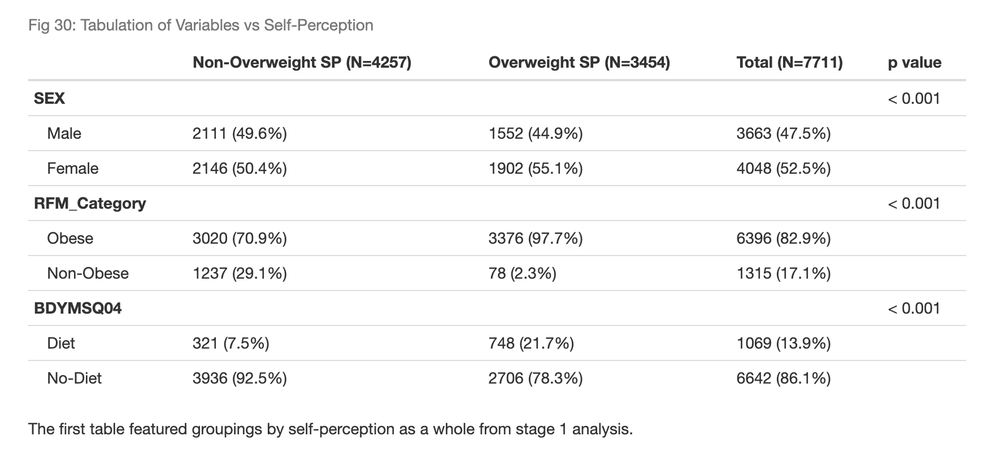
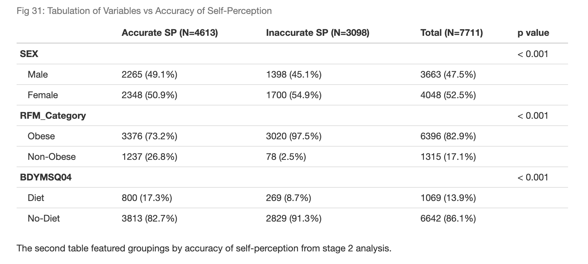

# Exploring the Impact of Psychological Factors on Obesity

## Overview:
This project aimed to investigate the psychological factors influencing obesity using data from the Australian Health Survey's biomedical dataset. Various advanced data analytics techniques, including Factor Analysis of Mixed Data (FAMD), logistic regression, and classification trees, were employed to analyze the data.

## Key Findings:
### Prediction of Overweight Self-Perception: 
Achieved an 81% accuracy in predicting overweight self-perception using logistic regression, revealing significant relationships between self-perception accuracy and variables such as gender and relative fat mass.

## Insights:
Weight Stigma and Health-Seeking Behaviors: Highlighted the implications of weight stigma on health-seeking behaviors, emphasizing the importance of proper diagnosis and support for individuals affected by obesity.

## Results:
* Logistic regression model accuracy: 81%
* Significant relationships identified between self-perception accuracy and gender, relative fat mass, etc.

## Conclusion:
This project sheds light on the complex interplay between psychological factors and obesity, providing insights that could inform interventions aimed at promoting healthier lifestyles and reducing weight stigma.

